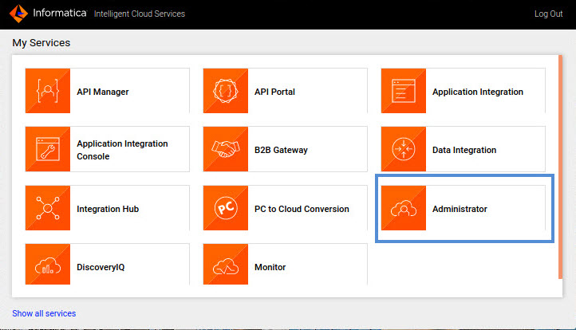

# Instalar IICS Secure Agent

En esta lección aprenderemos a Instalar **Informatica Cloud Secure Agent** en Linux con los siguientes pasos:

1. Para comenzar con la instalación de **Secure Agent** es necesario ingresar a [Informatica Intelligent Cloud Services (IICS)](https://dm-us.informaticacloud.com/) e ingresar usuario y contraseña.

2. Seleccionar opción **Administrator**:



3. Elegir la opción **Runtime Environments** y seleccionar **Download Secure Agent**.


4. Seleccionar el sistema operativo donde se instalará el agente, para este ejemplo usaremos  **Linux 64** (copiar y guardar el texto que aparece en **Install Token** ya que posteriormente se ocupará en la configuración). Dar clic en **Download** para iniciar la descarga del instalador del agente seguro.


5. Abrir una terminal y ejecutar los siguientes comandos:

```bash
$ cd ~/Downloads
$ chmod a+x agent64_install_ng_ext.bin
$ ./agent64_install_ng_ext.bin
```

6. Especificar la ruta donde se instalará el agente, para este caso ingresar la ruta **/iics/agent**, dar clic en **Next** y seleccionar las opciones por default.

> La VM ya tiene instalado el agente seguro `vm-training`, por lo que para efectos demostrativos puede usar la ruta `/iics/agent2`


7. Ejecutar los siguientes comandos para iniciar el servicio del agente seguro:

```bash
$ cd /iics/agent/apps/agentcore
$ ./infaagent startup
```

> **Nota: este comando no regresa algún resultado**

8. Ejecutar el siguiente comando para conocer el estatus de nuestro servicio el cual no debe estar en ejecución.

```bash
$ ./consoleAgentManager.sh getstatus
```

> El resultado debe indicar **NOT_CONFIGURED**


9. Ejecutar el siguiente comando para registrar el agente seguro en IICS:

```bashell
$ ./consoleAgentManager.sh configureToken <user> <token>
```

> **User: Correo**
> **Token: La clave que copiamos al descargar el instalador**

```
# resultado

Login with Token
Login succeeds
```

10. Consultar nuevamente el estatus de nuestro servicio:

```bashell
$ ./consoleAgentManager.sh getstatus
```

```
# resultado

Deploying
Running
```

11. Volver a IICS para validar si el agente seguro se encuentra funcionando. Seleccionamos **Administrator**->**Runtime Environments**. En este punto seleccionamos el agente que acabamos de iniciar (**vm-training**) para ver el detalle de los servicios.  


12. Validar que todos los servicios se encuentran funcionando como se muestra en la siguiente imagen:


> Como instructor, puede usar los scripts: `infaagent_start.sh` y `infaagent_stop.sh` del directorio `/home/axity` para iniciar el agente preinstalado. Es importante iniciar los servicios de este agente ya que es utilizado durante los ejercicios del curso.
