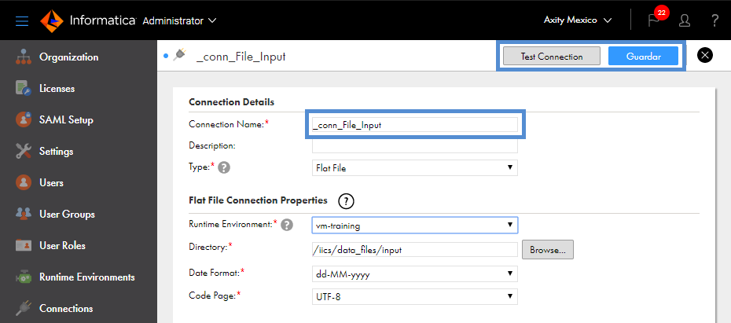

# Crear una conexión

En esta lección aprenderemos a crear una conexión en IICS. Para esto debemos ejecutar los siguientes pasos:

1. Ingresamos a [IICS](https://dm-us.informaticacloud.com) y seleccionamos **Administrator**->**Connections**->**New Connection**.

2. Realizar la configuración de la conexión como se muestra en la siguiente imagen:

> En **Connection Name** agregar sus iniciales como sufijo, por ejemplo: **_conn_File_input_abc**.

3. Guardar y dar clic en **Test Connection**, si la configuración se realizó correctamente se nos mostrara el siguiente mensaje: **The test for this connection was successful**.
