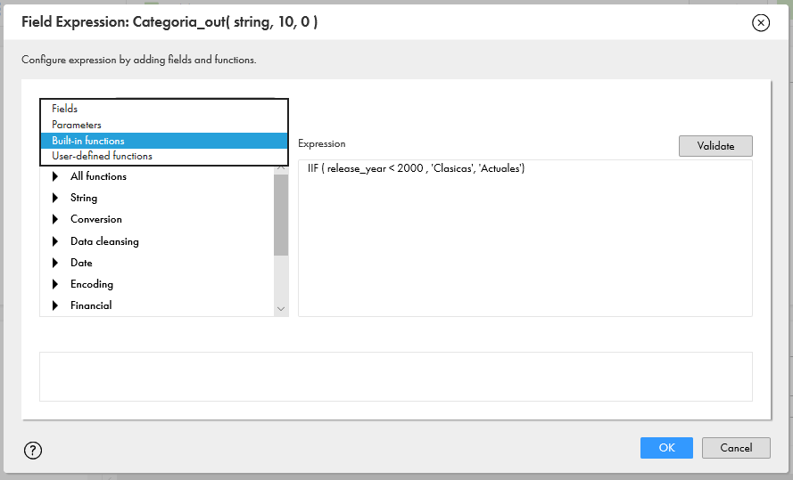

# Mappings

En esta lección aprenderemos a generar mapeo de datos y transformaciones de Informatica:

- Mapeo Directo
- Expression
- Filtros
- Router
- Agrupación

1. Ingresamos a [IICS](https://dm-us.informaticacloud.com) y seleccionamos **Data Integration**.


2. En la pantalla de inicio podemos visualizar una estadística de la cantidad de objetos tenemos. Dar clic en **Explorar**.


3. Ingresar en el proyecto **_pro_cap_iics** y posteriormente dar clic en **New Folder**.


4. En la ventana que se desplegó, ingresar las iniciales del participante y una breve descripción.


## Mapeo Directo

1. Después de crear la carpeta, en el panel izquierdo dar clic en el botón **Nuevo**. Seleccionamos **Mappings**->**Mapping** y dar clic en **Create**.


2. Nombramos nuestro mapping **M_Practica** y agregamos una breve descripción.


3. Seleccionar el objeto **Source** y después seleccionar la sección **Source**. Realizar la siguiente configuración:

	- Connection: **_conn_File_input**
	- Source_Type: **Single Objet**
	- Object: **netflix_titles.csv**


> Al dar clic en **Select** se nos desplegarán los archivos asociados a la conexión. Seleccionamos **netflix_titles.csv** y dar clic en **OK**.


4. Para validar que el archivo se puede visualizar correctamente, elegir la opción **Preview Data**, en caso de que marque algún error seleccionamos **Formatting Options** y elegir manualmente el tipo de formato del archivo.

5. Seleccionamos el objeto **Target** y después seleccionar la sección **Target**. Realizar la siguiente configuración:

	- Connection: **_conn_File_output**
	- Source_Type: **Single Objet**
	- Object: **Salida_Netflix.csv**


6. Al seleccionar el **Objeto** debemos elegir **Create New at Runtime** e ingresar el nombre del archivo de salida **Salida_Netflix.csv**. En caso de ser necesario seleccionar **Formatting Options**.


7. En este menú podemos determinar el tipo de formato para la salida de nuestro archivo, por default se genera con las siguientes características:


8. Al finalizar la configuración de **Target**, guardar los cambios y revisar que el mapping esté en estatus **Valid**. Finalmente ejecutamos el mapping.


9. Al seleccionar **Run**, se nos desplegará una ventana donde elegiremos el Agente Seguro con el que se va a ejecutar el mapping, seleccionar **vm-training** y dar clic en **Run**.


10. Abrimos una nueva página de IICS y seleccionamos **Monitor**.


11. En el menú de Monitor veremos los Jobs que se encuentran corriendo **Running Jobs**, en caso de no visualizar nuestro mapping seleccionamos **All Jobs** y verificamos el estatus de nuestro Job, en caso de requerir más detalle dar clic en el nombre de nuestro mapping.


12. En el detalle del monitor podemos visualizar el número de registros leídos y procesados, en caso de alguna falla se nos mostrará el error y los registros rechazados, para más detalle podemos dar clic en **Download Session Log**


## Expression

1. Entrar a la carpeta de trabajo y seleccionar el mapping que creamos previamente **M_Practica**, dar clic derecho y seleccionar **Copy To**, elegimos nuestra carpeta de trabajo y cambiamos el nombre del mapping por **M_Practica_Exp**.


2. En **Source** seleccionamos **Fields** y modificamos la metadata, para cambiar el tipo de dato del campo **release_year** a **integer** de **10**.


3. Desde la paleta de transformaciones agregamos al mapping un **Expression** y lo enlazamos desde el **Source**.


4. En las propiedades del **Expression** seleccionamos **Expression** y después en **+** para agregar un nuevo puerto y configurarlo de la siguiente manera:


5. En el nuevo puerto dar clic **Configure...**.


6. Configurar el nuevo puerto de la siguiente manera.


7. Creamos un nuevo puerto que se llama **Categoria_out** de tipo **String** de **10** y agregamos el siguiente código:

```
IIF (release_year < 2000, 'Clasicas', 'Actuales')
```



> Con la opción **Build-in Function** se pueden ver todas las funciones disponibles y su sintaxis.

8. Conectar el **Expression** al **Target**. Seleccionar el **Target** y seleccionar **Incoming Fields**. Los nuevos puertos se visualizarán en la columna **Origin** con el nombre del **Expression**.


> En la sección de **Target** cambiar el nombre del archivo de salida **Categoria_Exp_[iniciales].csv**

9. **Guardar** los cambios, revisar que el mapping sea **Válido** y **Ejecutar**.

10. Validar en el monitor que el proceso se ejecutó correctamente y después revisar el archivo de salida para validar que se encuentran los dos nuevos campos.


## Filter

1. Duplicar el mapa **M_Practica_Exp** y renombrarlo como **M_Practica_Fil**.

2. Agregar en el mapping un **Filter** y conectarlo entre el **Expression** y el **Target**.


3. En las propiedades del Filtro, seleccionar **Filter** y dar clic en el símbolo **+**. En la configuración utilizaremos el campo **Release_year** donde el operador sea **>** de **1990**.


> **Nota:** El campo que se ocupará en la condición debe tener un tipo de dato válido, en este ejemplo es *Integer*.

4. Conectamos el **Filter** al **Target** y configuramos la salida del archivo como **Categoria_Fil_Iniciales.csv**.

5. **Guardar** los cambios, revisar que el mapping sea **Válido** y **Ejecutar**.

6. En el monitor podemos visualizar que el total de registros de entrada es diferente a los de salida, ya que al agregar el filtro únicamente pasan aquellos registros que cumplen con la regla.


## Router

Esta transformación es muy parecida al filtro, pero nos permite generar una o más salidas por medio grupos y cada uno con condiciones diferentes.

1. Duplicar el mapping **M_Practica_Exp** y renombrarlo como **M_Practica_Rtr**.

2. Agregar en el mapping un **Router** entre el **Expression** y el **Target**.


3. En las propiedades del Router, seleccionar **Output Groups**, dar clic en el simbol **+**, renombramos el grupo como **N_2000** y damos clic en **Configure...**


4. En esta pantalla damos clic en **+** y agregamos una condición donde el valor del campo **release_year** sea **igual a 2000**.


5. Generamos 2 grupos más para los años 2010 y 2019, quedando de la siguiente manera:


6. Agregamos 3 **Target's** al mapping con los siguientes nombres:

	- T_Salida_2000
	- T_Salida_2010
	- T_Salida_2019

7. Enlazar el **Router** con los **Target's**, para realizar esto damos clic en el símbolo **+** para que se desplieguen los grupos y poder enlazarlos con el **Target** que corresponde.


> **Nota:** El grupo **DEFAULT1** nos devuelve los registros que no cumplen con ninguna condición, es opcional enlazarlo con algún **Target**.

8. Configuramos las salidas de los **Target's** dejando como salida los siguientes archivos:

	- Categoria_2000_iniciales.csv
	- Categoria_2010_iniciales.csv
	- Categoria_2019_iniciales.csv

9. **Guardar** los cambios, revisar que el mapping sea **Válido** y **Ejecutar**.

10. En el Monitor podemos validar que se cargue información en cada **Target** si estos cumplieron con la condición, como se muestra en la siguiente imagen:


## Aggregator

1. Duplicar el mapping **M_Practica_Exp** y renombrarlo como **M_Practica_Agg**

2. Agregar en el mapping un **Aggregator** entre el **Expression** y el **Target**.


3. En las propiedades del **Aggregator** seleccionar **Incoming Fields**, seleccionar la regla actual y configurarla de la siguiente manera:


4. De la columna **Details** dar clic en **3 fields**.

5. Seleccionamos en los campos que vamos a utilizar, en este caso serán: **Categoria_out**, **release_year** y **type**.


6. Seleccionar la sección **Group by** y dar clic en el símbolo **+** para agregar los campos por los que se agruparán los datos **(type y Categoria_out)**.


7. Seleccionar la sección **Aggregate** y dar clic en el símbolo **+** para agregar dos campos con la siguiente configuración:


8. En la columna **Expresión** dar clic en cada opción para configurar las reglas de agregación como sigue:

	- **Conteo ->** `count(*)`
	- **Anio_Max ->** `max(release_year)`


9. Enlazamos el **Aggregator** al **Target** y configuramos la salida del archivo como **Categoria_Agg_[Iniciales].csv**

10. **Guardar** los cambios, revisar que el mapping sea **Válido** y **Ejecutar**.

11. En el monitor podemos visualizar la cantidad de registros que arroja el mapping después de la agrupación.


12. Los datos se visualizarán de la siguiente forma


